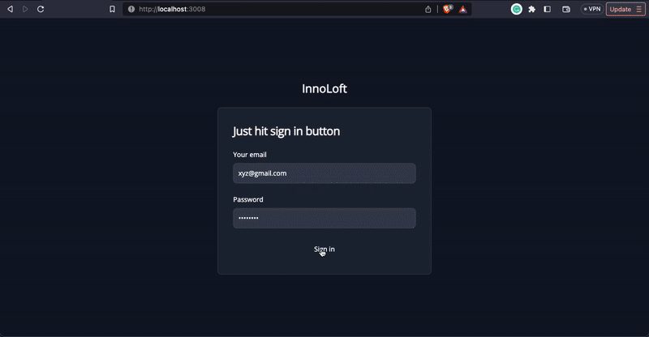
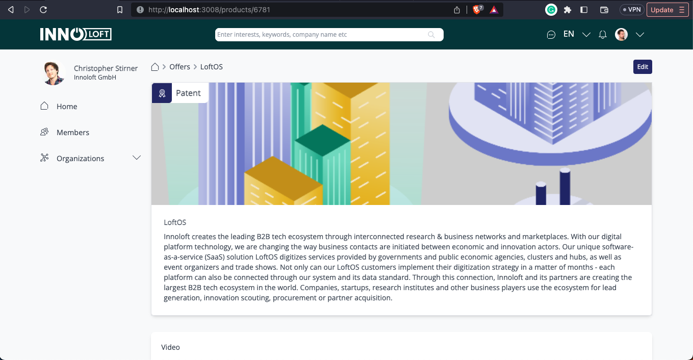
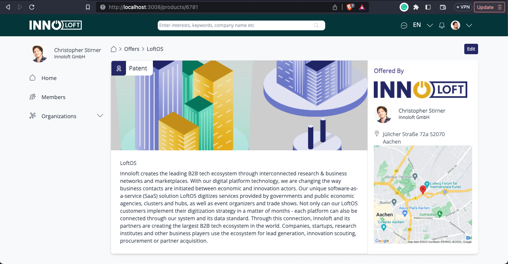

# Innosoft Dashboard



### Dashboard without user profile on the right


### Dashboard with app id as two


- [Live Demo](https://dashboardinnoloft.netlify.app/)

> Create a new dashboard with which you will be displaying and editing product information


## Built With

- Major languages (HTML, CSS, TypeScript)

- Frameworks / Libraries
  ```bash
  - React - Next.js
  - Git (version control)
  ```

- Technologies used 
  
  ``` bash
  - Git(version control)
  ```


## Getting Started

To get a local copy up and running follow these simple example steps.

### Prerequisites
 - A text editor(preferably Visual Studio Code)

### Install
  -  [Git](https://git-scm.com/downloads)
  -  [Node](https://nodejs.org/en/download/)

### Usage
#### Clone this repository

```bash
$ git clone https://github.com/clintonjosephs/innoloft.git
$ cd innoloft
```
#### Run project

```bash
$ npm install
$ npm run dev
```

#### Open page in browser
```bash
$ runs on http://localhost:3000/
```

## Author

👤 **Clinton Mbonu**

- GitHub: [@clintonjosephs](https://github.com/clintonjosephs)
- LinkedIn: [LinkedIn](https://linkedin.com/in/clinton-mbonu)
- Twitter: [@clintonmbonu2](https://twitter.com/clintonmbonu2)

